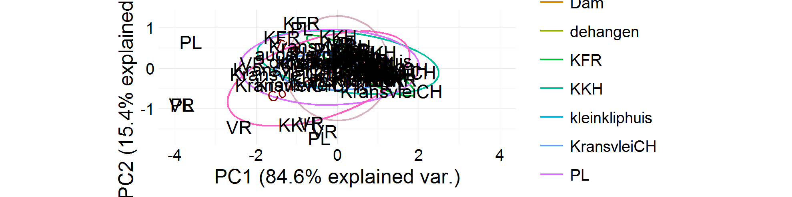
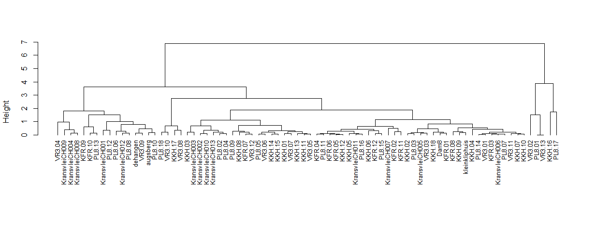

```{r, load_libraries, echo=FALSE, message=FALSE}
library("knitr")
library("kfigr")
library("plyr")
library("dplyr")
library("SteeleVR003MSAPigments")
opts_chunk$set(fig.width = 6)
```

```{r, run_functions, echo=FALSE, message=FALSE, cache=TRUE, results="hide", warning=FALSE, include = FALSE}

# run all non-plotting functions, takes such a long time... >30 min

# need to setwd to /vignettes if working interactively 
# assuming you are already in the directory Steele_et_al_VR003_MSA_Pigments
# which is where you'd be if you opened the .Rproj file

# setwd(paste0(getwd(), "/vignettes"))

df <- read_in()

aucAllSamples <- channels_and_AUC(df$df, df$files)

combys9 <- subset_5_runs(aucAllSamples$aucAllSamples, aucAllSamples$elementList)

combys9 <- corr_with_Fe(combys9)

combys12 <- calibration(combys9$combys9, combys9$remaining)

plots(combys12$combys12)

ochre_data <- get_ochre_data()

HDI_corr <- mag_sus_corr(ochre_data)

surface <- surface(ochre_data)
```

## MIDDLE STONE AGE PIGMENTS 

We found pigments throughout the Main Area  sequence, and a few at the base of the Inside the Shelter sequence. The majority are ochre (N=285), but none of these pieces showed clear evidence of having been worked (no grinding or scoring), although one had been flaked. Manganese, which streaks purple when tested on unglazed ceramic, is also present (n=175), and 17 pieces have been flaked but not otherwise worked.

Ochre is common in Middle Stone Age sites in South Africa, and is thought to have been used as a pigment Henshilwood et al. 2009, Marean et al. 2007), art object itself (Mackay & Welz 2008), with some specimens demonstrating engravings, or even an ingredient for binding composite tools (Wadley 2005). While we have an approximation of the timing and functions of ochre in MSA sites, we have only a limited understanding of how ochre specimens from different sites relate to each other. As a preliminary investigation of the regional context of the ochre from VR003, we sampled ochre from seven of the ten VR003 contexts  in which it occurred below III-15, and six of the eight HP or marginal HP (III-17 to III-20) contexts, and combined these with 60 samples of ochre from excavations at the three other archaeological sites as well as geological samples of ochre from four surface outcrops on the landscape surrounding the sites. We used a set of non-destructive methods to record the metric dimensions, Munsell colour and basic visible attributes. Additional preliminary compositional characterisation was undertaken by magnetic susceptibility analysis and X-ray fluorescence analysis. 

```{r, massfig, echo=FALSE, anchor='massfig', fig.cap="Plot of ochre specimen mass"}
# kable(ochre %>%
#   group_by(site) %>%
#   summarise(mass =  mean(weight, na.rm = TRUE), 
#             length = mean(length, na.rm = TRUE), 
#             width = mean(width, na.rm = TRUE), 
#             thickness = mean(thickness, na.rm = TRUE)))

ochre_mass(ochre_data)

```

```{r, bayesfig, echo=FALSE, anchor='bayesfig', message=FALSE, fig.cap="Bayesian Two Sample t-test: weight by context", cache=TRUE}

HDI_mean_diff <- b_t_t(ochre_data)

```

```{r, magsusdffig, anchor='magsusdffig', echo=FALSE, warning=FALSE, fig.cap="Plot of magnetic susceptibility by frequency dependency"}

freq_dep_plot(ochre_data)

```


The mass of the ochre pieces ranges from `r max(ochre_data$weight)` to `r min(ochre_data$weight)` g, with the specimens from geological sources significantly larger than the archaeological pieces (`r figr('bayesfig', TRUE, type="figure")`, 95% HDI for difference in means = `r unname(round(HDI_mean_diff, 2))`, if this interval excludes zero then the means are credibly different, see Kruschke 2013 for details). Exterior colour ranges widely in hue (including red, brown, orange, pink, purple) and value (light, dark). Surface textures of specimens similarly vary with most pieces having an irrgular surface (`r filter(surface, Var1 == 'i') %>% select(., Freq) %>% round(1)`%) and smaller proportions with angular and rounded surfaces. These ranges of size, colour and surface texture suggests a diversity of sources and transport mechanisms for ochre on this landscape. 

To explore the diversity of sources we investigated the mineralogy of the specimens with two basic non-destructive methods. Non-destructive methods were preferred to minimise damage of the ground facets on some of the specimens. The first method was magnetic susceptibility, with each specimen measured 20 times each at high and low frequency with a Bartington MS2 and MS2K surface sensor. This technique is useful for identifiying different proportions of antiferromagnetic magnetic minerals such as hematite (red ochres) and goethite (yellow ochres) and ferrimagnetic minerals such as magnetite or maghemite (Mooney et al. 2003).

```{r, amagsusfig, anchor='magsusfig', echo=FALSE, warning=FALSE, fig.cap="Plot of magnetic susceptibility by site"}

mag_sus_plot(ochre_data)

```


Specimens from KFR and KKH stand out with high magnetic suseptibiliy values, suggesting relatively higher proportions of magnetite and haghemite than hematite and goethite `r figr('magsusfig', TRUE, type="figure")`. The correlation of frequency dependancy and low frequency mass susceptibility is low (`r figr('magsusdffig', TRUE, type="figure")`, 95% HDI of correlation = `r unname(round(HDI_corr,2))`), indicating high variation in magnetic grain sizes accross the specimens. Frequency dependency values vary widely accross specimens from a single location, with no sign of location-based clustering. High frequency dependecy values indicate the presence of very fine-grained metastable magnetic grains spanning the superparamagnetic-stable single domain boundary. Such fine sizes are often indicative of authigenic magnetic minerals, suggesting differential mineral transformations at each location. The magnetic susceptibiltiy data are consistent with the basic physical attributes in demonstrating a high degree of variation in the ochre assemblage. 

The second non-destructive method we used to characterise compositional variation of the ochre was elemental analysis using X-ray fluorescence. The elemental composition of each sample was determined using a portable XRF instrument (Bruker Tracer III-V Light Element Analyzer) at 40 keV, 15 uA, using a 0.076 mm copper filter and 0.0305 aluminium filter in the X-ray path for a 300 s live-time count per spot, over ten spot locations on each piece of ochre. Iron oxides are usually the dominant component of ochres, with additions of clays, aluminosilicates and other minerals. During visual inspection of the samples we found the surfaces of the ochre pieces to be quite heterogenous, so we took a subset of the five locations on each piece of ochre that had the lowest relative standard error in the amount of iron (as the most abundant element) to characterize the bulk composition of the specimen. To analyse the data we used R (R Development Core Team 2014) and followed the proceedures of Popelka-Filcoff et al. (2007, 2008). Only elements that could be reliably measured in a majority of the samples (i.e. not below detection limits) were used for the analysis. A Pearson's correlation was used to determine which elements were associated with iron, and only those elements that were positively correlated (within the 90% confidence interval) with iron were retained for further analysis. To compensate for the variable levels of non-iron minerals in the ochre specimens (generally low in this sample at 1-11% mass), data analysis was performed on log-10 values of the ratio between the element and Fe in the sample. Taking the iron ratio treats variation in iron concentration as a dilution factor by other components, and the log-10 transformation minimizes the effect of the non-normal distributions of the individual elements (Popelka-Filcoff et al. 2007, 2008). The calibration standards used in the XRF measurements were NIST SRM 97b (Flint Clay), NIST SRM 679 (Brick clay) and NIST SRM 98b (Plastic clay).

The overall low concentrations of iron in these specicmens is problematic for portable XRF analysis since the diagnostic transition metals and rare earth elements, that are often signatures of sources, are only present in very small quantities that are at or below the sensitivity of the pXRF. Following the correlation analysis and ratio to iron transformations, Cobalt and Titanium remained as elements with useful measurements. Cornell and Schwertmann (2003) have suggested that transition metals such as these occur within iron oxides as iron substitutes, so variation in their abundance may be characteristic of different sources, independant of environmental effects such as weathering. `r figr('pcafig', TRUE, type="Figure")` shows the output of a principal components analysis with ellipses showing ht 68% probability regions for each group. The groups all overlap substantially, indicating that the pXFR data do not indicate groups of distinct sources for the specimens. Looking at the dendrogram in `r figr('dendroplot', TRUE, type="figure")`, we see that clustering occurs at low levels, with poor differntiation. One of the most striking patterns is that the geological specimens from Kransvlei forming two clear groups, but these groups don't include all speciments from that outcrop, indicating high within-outcrop variability. Elsewhere on the dendrogram we see pairs and triplets of archcaeological specimens from similar stratigraphic contexts, such as KFR.09 and KFR.10, KFR.04, KFR.05, KFR.06, as well as VR05, VR3.06 and VR3.07. 

```{r pcafig, anchor='pcafig', results='asis',echo=FALSE, warning=FALSE, cache=TRUE}
cat("<p>")
```

[//]: # 


```{r dendroplot, anchor='dendroplot', results='asis',echo=FALSE, warning=FALSE, cache=TRUE}
cat("<p>")
```

[//]: # 

These low-level, small-scale groupings suggest a number of possibilities. First, they may indicate expedient exploitatation of numerous sources rather than a systematic and long-term focus on a small numer of sources. This might reflect a high level of mobility of site occupants. Second, they may indicate a high rate of circulation of ochre between sites on the landscape, such that each site is supplied by several sources. This would instead be related to a high level of exchange activity, rather than group or indidividual mobility. However, with the low concentrations of iron in the specimens, and the limitations of our pXRF in measuring only two elements robustly, it is difficult to certain of the most probable interpretation. Future work with more destructive methods, including removing the surface of the specimens to analyse the core minerals using INAA, electron microprobe or LA-ICP-MS may reveal more detailed patterns because of the higher dynamic ranges of measurement and the wider range of elements that can be detected. 

### References

Cornell, R. M., & Schwertmann, U. (2006). The iron oxides: structure, properties, reactions, occurrences and uses. John Wiley & Sons.

Henshilwood, C. S., d' Errico, F., & Watts, I. (2009). Engraved ochres from the Middle Stone Age levels at Blombos Cave, South Africa. Journal of Human Evolution, 57(1), 27-47. doi:10.1016/j.jhevol.2009.01.005

Kruschke, J. K. (2013). Bayesian estimation supersedes the t test. Journal of Experimental Psychology: General 142(2), 573.

Mackay, A., & Welz, A. (2008). Engraved ochre from a Middle Stone Age context at Klein Kliphuis in the Western Cape of South Africa. Journal of Archaeological Science, 35(6), 1521-1532. doi:10.1016/j.jas.2007.10.015

Marean, C. W., Bar-Matthews, M., Bernatchez, J., Fisher, E., Goldberg, P., Herries, A. I. R., . Williams, H. M. (2007). Early human use of marine resources and pigment in South Africa during the Middle Pleistocene. Nature, 449(7164), 905-908. doi:10.1038/nature06204

Mooney, S. D., Geiss, C., & Smith, M. A. (2003). The use of mineral magnetic parameters to characterize archaeological ochres. Journal of Archaeological Science, 30(5), 511-523. doi:10.1016/S0305-4403(02)00181-4

Popelka-Filcoff, R.S., Robertson, J.D., Glascock, M.D., Descantes, C., 2007. Trace element characterization of ochre from geological sources. Journal of Radioanalytical and Nuclear Chemistry 272 (1), 17-27.

Popelka-Filcoff, R.S., Miksa, E.J., Robertson, J.D., Glascock, M.D., Wallace, H., 2008. Elemental analysis and characterization of ochre sources from Southern Arizona.Journal of Archaeological Science 35, 752-762.

R Development Core Team. (2014). R: A Language and Environment for Statistical Computing. Retrieved from http://www.R-project.org/

Wadley, L. (2005). Ochre crayons or waste products? Replications compared with MSA "crayons" from Sibudu Cave, South Africa. Before Farming, 2005(3), 1-12. doi:10.3828/bfarm.2005.3.1

```{r}
# make the summary data table
the_ochre_table <- ochre_table(ochre_data, combys12$combys11)
```


